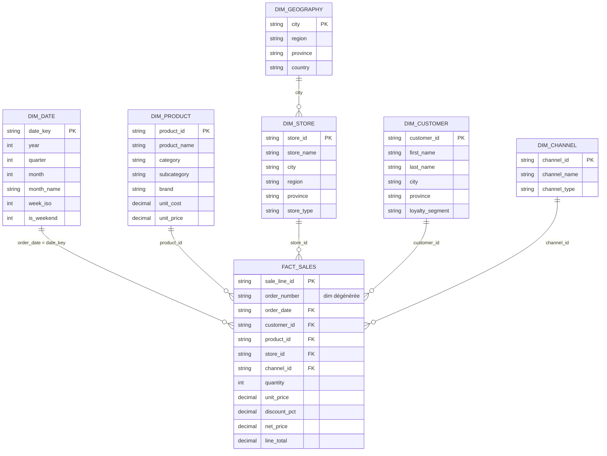

# Board Brief — S02

## Question du CEO

> « Quel schéma en étoile rend votre question CEO répétable et fiable chaque mois ? »


## Schéma en étoile



## Grain statement

**1 ligne = 1 ligne de commande**, identifiée par `sale_line_id`, représentant la vente d'un produit précis dans une commande donnée. Une même commande (`order_number`) peut contenir plusieurs lignes — une par produit acheté.

Ce grain est conservé tel quel car il permet de répondre aux questions stratégiques sur les catégories de produits, les quantités vendues par produit, les revenus par région et par période — sans perte d'information.


## Réponse exécutive

Le modèle est maintenant en place pour répondre à la question du CEO de façon répétable et fiable. Le schéma en étoile construit autour de `fact_sales` — avec 5 dimensions conformes (produit, magasin, date, client, canal) — fournit la structure nécessaire pour analyser les ventes par catégorie, région et période. Nous sommes toujours en mode exploratoire : la preuve du déclin par catégorie et par région sera établie une fois les requêtes SQL exécutées contre la base NexaMart. Le schéma garantit que cette analyse pourra être reproduite chaque mois sans modification de structure.


## Décisions de modélisation

Le modèle retient une approche en **étoile pure (Kimball)** avec 6 dimensions : `dim_product`, `dim_store`, `dim_date`, `dim_customer`, `dim_channel` et `dim_geography`. Pour éviter le pattern **snowflake** — qui multiplierait les jointures et alourdirait les requêtes — chaque dimension sera **dénormalisée** : tous les attributs géographiques (ville, région, province, pays) seront intégrés directement dans `dim_store` plutôt que dans une table `dim_geography` séparée. La même logique s'applique aux autres dimensions : les hiérarchies (ex. catégorie → sous-catégorie dans `dim_product`) restent à plat dans une seule table large. Ce choix privilégie la simplicité des requêtes et la performance analytique au détriment d'un espace de stockage légèrement plus élevé — un compromis acceptable étant donné que NexaMart ne constitue pas une base de données volumineuse et complexe. Rester en étoile nous donne l'agilité nécessaire pour faire évoluer le modèle rapidement au fil des séances.


## Preuve

```sql
SELECT
    p.category,
    s.region,
    d.year,
    d.quarter,
    SUM(f.line_total)              AS total_revenue,
    SUM(f.quantity)                AS total_units,
    COUNT(DISTINCT f.order_number) AS nb_commandes
FROM raw_fact_sales f
JOIN raw_dim_product  p ON f.product_id = p.product_id
JOIN raw_dim_store    s ON f.store_id   = s.store_id
JOIN raw_dim_date     d ON f.order_date = d.date_key
GROUP BY p.category, s.region, d.year, d.quarter
ORDER BY d.year, d.quarter, total_revenue DESC;
```


## Validation

La validation couvre trois niveaux. **Intégrité des jointures** : vérifier qu'aucun `product_id`, `store_id` ou `order_date` dans `fact_sales` n'est NULL ou orphelin — une clé sans correspondance dans sa dimension produirait des lignes exclues silencieusement. **Forme du résultat** : la requête doit retourner une ligne par combinaison unique de catégorie × région × année × trimestre, avec des valeurs non nulles pour `total_revenue` et `total_units`. **Unicité des dimensions** : confirmer qu'il n'y a aucun doublon sur `product_id` dans `dim_product`, `store_id` dans `dim_store` et `date_key` dans `dim_date` — un doublon gonflerait les agrégats.


## Risques / limites

Plusieurs limites subsistent à ce stade. **Données brutes non transformées** : le schéma s'appuie encore sur les tables `raw_*` — les dimensions Kimball propres (`dim_*` sans préfixe) avec clés de substitution ne sont pas encore construites. **Pas de détection de tendance** : la requête retourne des totaux par période mais ne calcule pas encore de variation année sur année ni de moyenne mobile — on peut voir les chiffres, pas encore le déclin. **Changements historiques non gérés (SCD)** : si un magasin change de région ou un client change de segment, l'historique sera attribué à la valeur actuelle, pas à celle du moment de la vente — ce problème sera adressé en S03. **Cause du déclin inconnue** : les sources complémentaires (retours, budget, promotions) ne sont pas encore intégrées au modèle.


## Prochaine recommandation

**S03 — Politique SCD :** définir et implémenter la politique de gestion des changements historiques (Slowly Changing Dimensions) pour les dimensions `dim_customer` et `dim_store`, afin que les rapports reflètent la réalité au moment de la vente et non la réalité d'aujourd'hui.

**Transformation des tables :** construire les vraies tables `dim_*` en transformant les `raw_*` — créer le modèle Kimball propre avec dénormalisation de `dim_store` intégrant les attributs géographiques. C'est le préalable à un entrepôt de données fiable et à la mise en place des SCD. En parallèle, exécuter la requête de preuve et valider les résultats reste une bonne pratique à maintenir à chaque itération.
